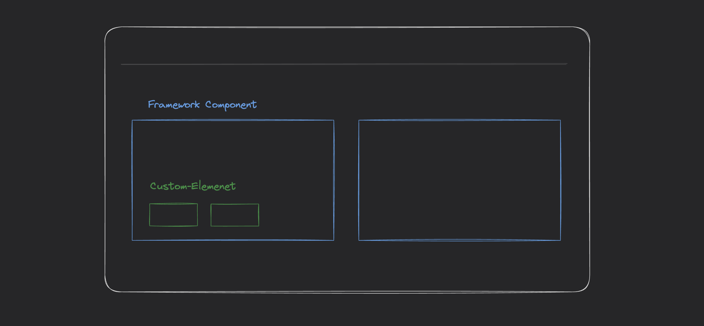

import { Command } from "package:/components"

To keep the amount of logic in Components small, Elements are built as unstyled [custom-elements](https://web.dev/articles/custom-elements-v1#prestyle) using [Lit](https://lit.dev/docs/) which makes them framework agnostic, so they can be reused within many requirements and with any framework.

Since they are defined by just an html tag, it forces you to think in a simple way: Props (Attributes) are just strings, which makes it possible to use them in any way html is used.

The lower-level API of custom-elements, compared to frameworks, also gives you the oppertunity to offer better performance.


The components in this library are composed of two layers:

- The first layer are **[Components](./components)**. they ready to use, framework specific and pre-styled Components that give you a solid starting point. You do not import Components as dependencies, they are copied into your projects codebase like templates.

- The second layer is the **[Elements](./elements)** layer. Elements are "Headless" custom-elements that only implement behavior with accessibility in mind, with as little styling as possible.



<br/>

This approach gives the given project ownership over the components design. We start with sensible defaults, then change the design for the projects needs.


## Usage

Components require **tailwindcss** to be installed in the project. Here links for [NuxtJS](https://www.npmjs.com/package/@nuxtjs/tailwindcss), [Vite](https://tailwindcss.com/docs/guides/vite) or [Tailwind cli](https://tailwindcss.com/docs/installation).

<br/>

1. Install elements

    <Command
      pnpm="pnpm add @sv/elements"
      npm="npm i @sv/elements"
      bun="bun add @sv/elements"
    />

2. Copy a component into your project.

    This **copies** a component template into your project.

    ```bash
    npx @sv/components button
    ```

    - src/components/
      - Button.tsx
    - README.md
    - package.json
    - ...

3. Change styling or behavior of the component in the copy inside your project.

    ```diff lang="tsx"
    // ~/components/Button.tsx

    export const buttonVariants = {
      outline: "rounded-lg border border-[#C09278] px-6 py-2 bg-transparent",
    -  solid: "rounded-lg bg-[#C09278] px-6 py-2 active:bg-[rgba(158,118,96,1)]",
    +  ghost: "p-2 flex items-center gap-2 text-2xl hover:text-[#C09278]",
    };

    export default function Button(props: {
      variant?: keyof typeof variants;
    }, context) {
      return (
        <button type="button" class={`cursor-pointer ${buttonVariants[props.variant ?? "solid"]}`}>
          {context.slots.default?.()}
        </button>
      );
    }
    ```

4. Import and use the components anywhere in your project.

    ```tsx
    // src/App.tsx
    import "~/components/Button";

    <Button variant="outline">Click me</Button>;
    ```

5. Or optionally use the custom-elements directly for most compatibility with, or without, a framework.

    ```tsx
    // src/App.tsx
    import "@sv/elements/a-expandable";

    export function App() {
      return (
        <div>
          <a-expandable opened></a-expandable>;
        </div>
      )
    }
    ```

<br/>

## Limitations of custom-elements

[Use custom-elements for what they are good at.](https://nolanlawson.com/2023/08/23/use-web-components-for-what-theyre-good-at/)
[Web Components Are Not the Future](https://dev.to/ryansolid/web-components-are-not-the-future-48bh)
[Web Components are not Framework Components — and That’s Okay](https://lea.verou.me/blog/2024/wcs-vs-frameworks/)

- Custom-elements work best when they are completely self-contained.
- They should not effect elements around itself.
- Do not create DOM elements in custom-elements to avoid layout-shifts.
- When fully client-side rendered, most of these limitations are not relevant.

## Server side rendering

Unless specific plugins for Lit SSR are used, **Elements** are not fully server side rendered. The custom-element tags will exist in the markup (like *\<a-track\/\>*), but only on the client the markup of the [shadow-root](https://lit.dev/docs/components/shadow-dom/) is generated.

This does not apply for the children of the Element, those are still rendered by the framework. Only the presentation of those children may vary from server to final hydrated client.

## Shallow dependency tree

Ship less code with less dependencies.


## Common Issues

<br/>

- **Layout shifts with hydration of custom-elements.** -- When elements or their children, that should be hidden, are visivle before hydration, a simple css selector with `:not(:defined) { opacity: 0; }` or `:not(:defined) * { display: none; }` may be used to hide them before hydration..

- **Failed to execute 'define' on 'CustomElementRegistry': the name "..." has already been used with this registry** -- There may be two versions of the same element imported.


## Browser Support

[Can I use](https://caniuse.com/mdn-api_window_customelements) Support for WebComponents exists in major browsers since around 2018.


[More information here](https://www.webcomponents.org/)
