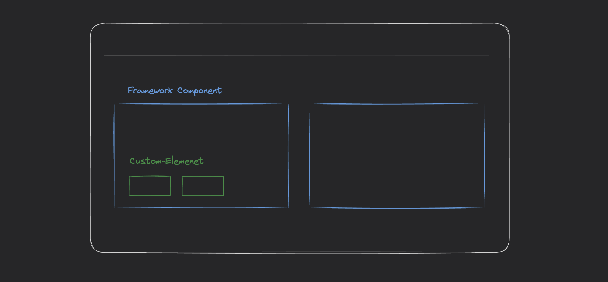

import { Command } from "package:/components"
import { Steps, FileTree } from '@astrojs/starlight/components';
import { AccordionDemo } from "./components/accordion/AccordionDemo";

This library serves as a place to collect and share code between projects and developers.

It includes libraries, Custom-elements and components for different frameworks to use in website creation and provides tooling to build and publish packages.

The components in this library are composed of two layers:

- The first layer are **[Components](./components)**. they ready to use, framework specific and pre-styled Components that give you a solid starting point. You do not import Components as dependencies, they are copied into your projects codebase like templates.

- The second layer is the **[Elements](./elements)** layer. Elements are "Headless" custom-elements that only implement behavior with accessibility in mind, with as little styling as possible.



<div class="not-content max-w-[800px]">
  <p>
    For example, this Accordion **Vue** Component, uses the `<a-expandable/>` custom-element to implement the animated expanding behaviour.
  </p>
  <AccordionDemo class="pt-4" client:only="vue" />
</div>

<br/>

This approach gives the given project ownership over the components design. We start with sensible defaults, then change the design for the projects needs.


## Usage

Components require **tailwindcss** to be installed in the project. Here links for [NuxtJS](https://www.npmjs.com/package/@nuxtjs/tailwindcss), [Vite](https://tailwindcss.com/docs/guides/vite) or [Tailwind cli](https://tailwindcss.com/docs/installation).

<br/>

<Steps>

1. Install elements

    <Command
      pnpm="pnpm add @atrium-ui/elements"
      npm="npm i @atrium-ui/elements"
      bun="bun add @atrium-ui/elements"
    />

2. Copy a component into your project.

    This **copies** a component template into your project.

    ```bash
    npx @atrium-ui/components button
    ```

    <FileTree>
    - src/components/
      - Button.tsx
    - README.md
    - package.json
    - ...
    </FileTree>

3. Change styling or behavior of the component in the copy inside your project.

    ```diff lang="tsx"
    // ~/components/Button.tsx

    export const buttonVariants = {
      outline: "rounded-lg border border-[#C09278] px-6 py-2 bg-transparent",
    -  solid: "rounded-lg bg-[#C09278] px-6 py-2 active:bg-[rgba(158,118,96,1)]",
    +  ghost: "p-2 flex items-center gap-2 text-2xl hover:text-[#C09278]",
    };

    export default function Button(props: {
      variant?: keyof typeof variants;
    }, context) {
      return (
        <button type="button" class={`cursor-pointer ${buttonVariants[props.variant ?? "solid"]}`}>
          {context.slots.default?.()}
        </button>
      );
    }
    ```

4. Import and use the components anywhere in your project.

    ```tsx
    // src/App.tsx
    import "~/components/Button";

    <Button variant="outline">Click me</Button>;
    ```

5. Or optionally use the custom-elements directly for most compatibility with, or without, a framework.

    ```tsx
    // src/App.tsx
    import "@atrium-ui/elements/a-expandable";

    export function App() {
      return (
        <div>
          <a-expandable opened></a-expandable>;
        </div>
      )
    }
    ```

</Steps>

<br/>

## Browser Support

[Can I use](https://caniuse.com/mdn-api_window_customelements) Support for WebComponents exists in major browsers since around 2018.


[More information here](https://www.webcomponents.org/)
