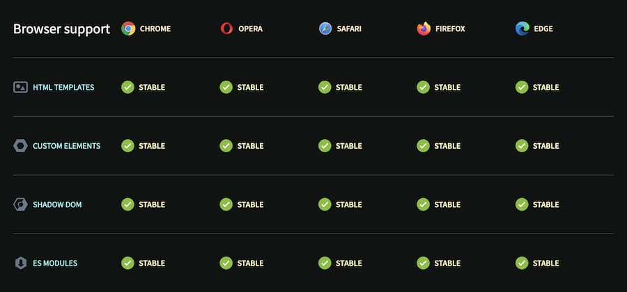

## Requirements

Components require **tailwindcss** to be installed in the project.

Here links for [NuxtJS](https://www.npmjs.com/package/@nuxtjs/tailwindcss), [Vite](https://tailwindcss.com/docs/guides/vite) or [Tailwind](https://tailwindcss.com/docs/installation) cli.

## Installation

### 1. Install the packages.

```bash
npm i @sv/elements @sv/components
```

### 2. Use a component in your project.

```bash
npx @sv/components use button
```

This **copies** a component template into your project.

### 3. Change styling or behavior of the component in the copy inside your project.

```diff lang="tsx"
// src/components/Button.tsx

const variants = {
  outline: "rounded-lg border border-[#C09278] px-6 py-2 bg-transparent",
  solid: "rounded-lg bg-[#C09278] px-6 py-2 active:bg-[rgba(158,118,96,1)]",
-  ghost: "p-2 flex items-center gap-2 text-2xl hover:text-[#C09278]",
+  link: "flex items-center gap-2 text-2xl hover:underline",
};

interface Props {
  children?: JSX.Element | string;
  variant?: keyof typeof variants;
}

// adapter pattern to be useable in vue, solid, and react components

// TODO: shouldnt destruct props because of solid js compat
export default function Button(props: Props, context) {
  const slots = {
    default: () =>
      props.children ? props.children : context?.slots?.default ? context?.slots.default() : null,
  };

  return (
    <button type="button" class={`cursor-pointer ${variants[props.variant ?? "solid"]}`}>
      <slots.default />
    </button>
  );
}
```

### 4. Import and use the components anywhere in your project.

```tsx
// src/App.tsx
import "~/components/Button";

<Button variant="outline">Click me</Button>;
```

### 5. Use elements directly anywhere in your project.

```tsx
// src/App.tsx
import "@sv/elements/a-expandable";

<a-expandable opened></a-expandable>;
```

<br/>

#### Support

[Can I use](https://caniuse.com/mdn-api_window_customelements) Support for WebComponents exists in major browsers since around 2018.



[More information here](https://www.webcomponents.org/)

<br/>

### Draft - TypeScript

```json
// /tsconfig.json
{
  "compilerOptions": {
    "types": ["@sv/elements"]
  }
}
```
