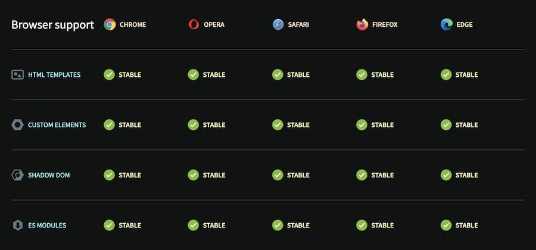

Custom elements are the foundation of Atrium's element layer. Understanding their strengths and limitations helps you use them effectively.

## How Elements Work

Elements are built as unstyled [custom elements](https://web.dev/articles/custom-elements-v1#prestyle) using [Lit](https://lit.dev/docs/). This makes them framework agnostic—reuse them with Vue, React, Astro, or vanilla JS.

Since they're defined by just an HTML tag, you're forced to think simply: props (attributes) are just strings. This constraint enables maximum compatibility with any way HTML is used.

The lower-level API of custom elements, compared to frameworks, also gives you better performance when used correctly.

## Limitations

[Use custom elements for what they're good at.](https://nolanlawson.com/2023/08/23/use-web-components-for-what-theyre-good-at/)

**Key constraints to keep in mind:**

- Custom elements work best when completely self-contained
- They should not affect elements around them
- Avoid creating DOM elements in custom elements to prevent layout shifts
- When fully client-side rendered, most of these limitations become irrelevant

**Further reading:**
- [Web Components Are Not the Future](https://dev.to/ryansolid/web-components-are-not-the-future-48bh)
- [Web Components are not Framework Components — and That's Okay](https://lea.verou.me/blog/2024/wcs-vs-frameworks/)

## Server Side Rendering

Unless specific plugins for Lit SSR are used, **Elements** are not fully server-side rendered. The custom element tags will exist in the markup (like `<a-track/>`), but the [shadow root](https://lit.dev/docs/components/shadow-dom/) markup is only generated on the client.

This does not apply to the children of the Element — those are still rendered by your framework. Only the presentation of those children may vary from server to final hydrated client.

## Common Issues

### Layout shifts with hydration

When elements or their children that should be hidden are visible before hydration, use CSS to hide them:

```css
:not(:defined) {
  opacity: 0;
}

/* Or hide children completely */
:not(:defined) * {
  display: none;
}
```

### CustomElementRegistry conflicts

**Error:** `Failed to execute 'define' on 'CustomElementRegistry': the name "..." has already been used with this registry`

**Cause:** Two versions of the same element are being imported.

**Solution:** Check your bundler configuration to ensure elements are only included once. This commonly happens when:
- Multiple packages depend on different versions of `@sv/elements`
- Elements are imported from both a component and directly

## Browser Support

[Can I use](https://caniuse.com/mdn-api_window_customelements) shows support for Web Components exists in major browsers since around 2018.



[More information on webcomponents.org](https://www.webcomponents.org/)
