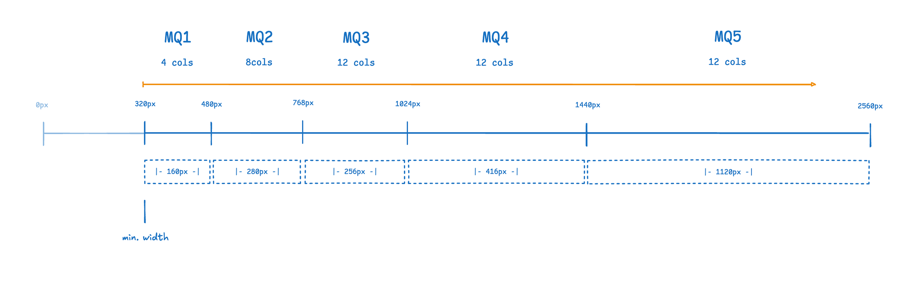

### Intro to Design Tokens

- Difference between primitives and styles
- Spacings
- Semantic colors
- Themeing using modes
- Grid and Breakpoints
- Token naming conventions

#### Grid

#### Sizing

<table>
  <tbody>
    <tr>
      <td class="font-bold">xs</td>
      <td>4px</td>
    </tr>
    <tr>
      <td class="font-bold">sm</td>
      <td>8px</td>
    </tr>
    <tr>
      <td class="font-bold">md</td>
      <td>16px</td>
    </tr>
    <tr>
      <td class="font-bold">lg</td>
      <td>24px</td>
    </tr>
    <tr>
      <td class="font-bold">xl</td>
      <td>32px</td>
    </tr>
    <tr>
      <td class="font-bold">2xl</td>
      <td>48px</td>
    </tr>
    <tr>
      <td class="font-bold">3xl</td>
      <td>64px</td>
    </tr>
    <tr>
      <td class="font-bold">4xl</td>
      <td>96px</td>
    </tr>
  </tbody>
</table>

#### Colors

#### Font

#### Icons

#### Elements

- using tokens in elements
